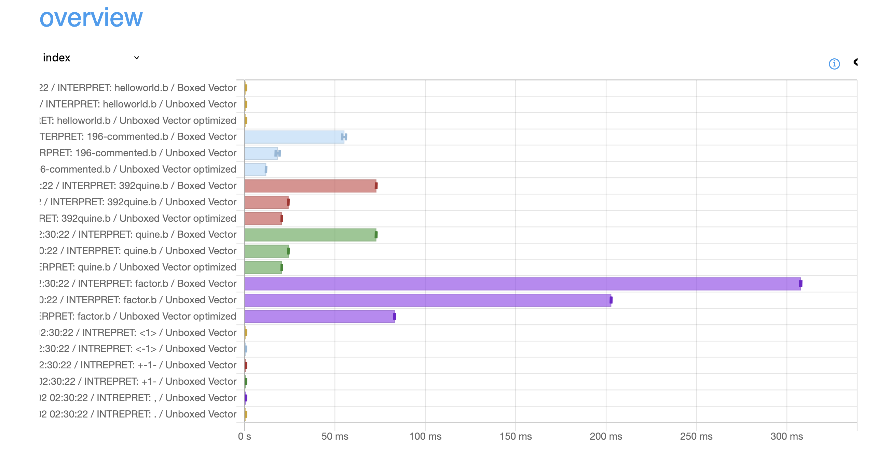

# brainhuck

A Haskell implementation of a Brainfuck interpreter.

The interpeter is implemented as an executable (installed with `stack install` in the directory), which can take 
the path of Brainfuck source code, or using the `--stdin` flag, execute code given as an argument to the 
interpeter.

Usage examples:

```bash
brainhuck path/to/program.b

brainhuck --stdin ">>>>+"

brainhuck program.b -s 100 > debug.txt
```

Flags/Options:   

```bash
-s --size               # memory size (default: 500 cells)
--stdin                 # execute code given as an argument
```

I have yet to to document the source code at least to some extent, nevertheless I think it's fairly readable, 
though maybe not so idiomatic, since I'm still a Haskell beginner-intermediate.

There are two modules for the interpeter in this project. Their only difference is that one uses Boxed Vectors
for the memory, and the other uses Unboxed Vectors. Its important to note, that there are two versions of the 
Unboxed version. One akin to the one with Boxed Vectors, and another that enables optimizations, by means of 
simplifying the actions (i.e. for "+++++", instead of performing one at a time, every adyacent '+' fuses into 
a single action). The difference in performance can be seen in the `bench.html` generated by criterion. Depending 
on the program, the optimizations will have varying impact on the final performance.



It is important to note that the `brainhuck` executable uses the optimized version.

This interpreter allows for different datatypes to be used as the memory used, only requiring for each datatype
a couple of typeclasses, and few more code. 

